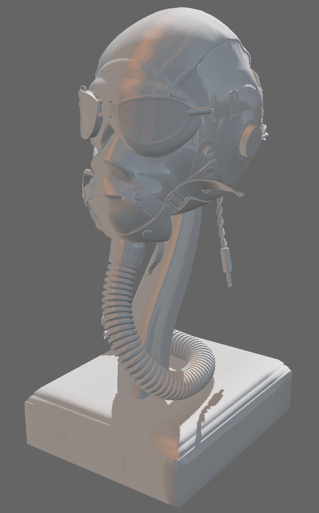

# PCF is now included in bevy 0.12: 
https://bevyengine.org/news/bevy-0-12/#pcf-shadow-filtering

-----

Example of Bevy's standard material defined externally

For use with bevy 0.11

This branch includes The Witness PCF from: https://github.com/bevyengine/bevy/pull/8006

See for reference:
https://github.com/bevyengine/bevy/blob/main/crates/bevy_pbr/src/pbr_material.rs
https://github.com/bevyengine/bevy/blob/main/crates/bevy_pbr/src/render/pbr.wgsl

This also swaps out any instances of the standard material with the custom included material. (see `swap_standard_material()`)
